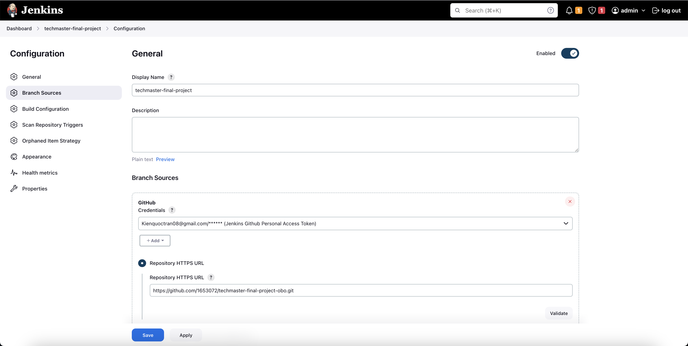
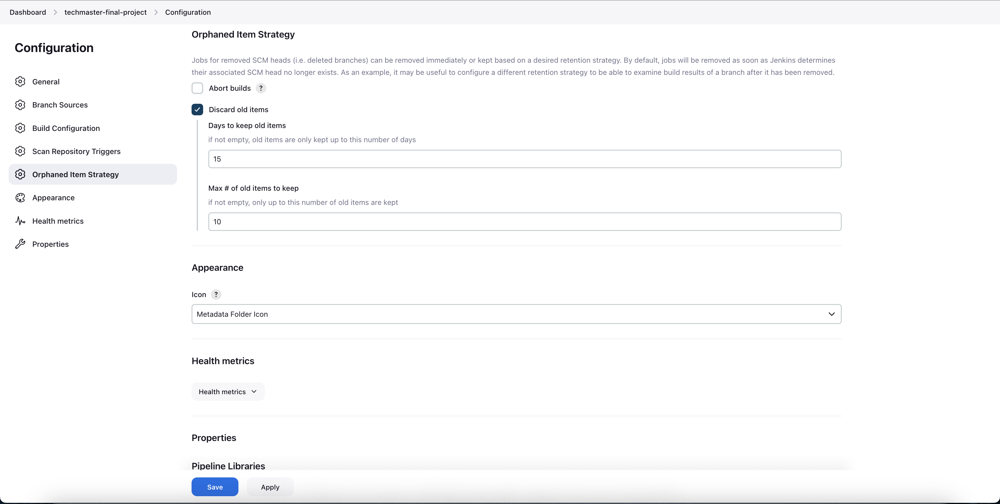

# TECHMASTER - FINAL PROJECT

## Table of Content

- [System Introduction](#introduction)
- [Setup 1: AWS EC2 Instances](#setup-1-aws-ec2-instances)
- [Setup 2: Docker Hub Registry, GitHub & Jenkins Configurations](#setup-2-docker-hub-registry-github--jenkins-configurations)
- [Setup 3: Jenkins Multibranch Pipeline](#setup-3-jenkins-multibranch-pipeline)
- [Setup 4: ArgoCD](#setup-4-argocd)
- [Setup 5: Prometheus & Grafana](#setup-5-prometheus--grafana)
- [Result Images](#result-images)
  - [1. Terraform Installation](#1-terraform-installation)
  - [2. Jenkins Multibranch](#2-jenkins-multibranch)
  - [3. ArgoCD](#3-argocd)
    - [3.1 ArgoCD Data Source Connection](#31-argocd-data-source-connection)
    - [3.2 ArgoCD Application (Dev)](#32-argocd-application-dev)
    - [3.3 ArgoCD Application (Prd)](#33-argocd-application-prd)
    - [3.4 ArgoCD Application (Helm)](#34-argocd-application-helm)
  - [4. Prometheus](#4-prometheus)
  - [5. Grafana](#5-grafana)

## System Introduction

1. **System Flow & Architecture**:
   - `TO BE DEFINED LATER`.

2. **Notes**:
   - `TO BE DEFINED LATER`.

## Setup 1: AWS EC2 Instances

1. **Introduction**: In this section, we'll initialize some necessary AWS EC2 instances, including:
    - 1st instance: CI/CD instance for Jenkins and ArgoCD. In this scope, we'll follow the CI/CD pull-based model for
      our source code changes.
    - 2nd instance: Monitoring instance for Prometheus and Grafana which consumes metrics from the 1st instance and
      visualize those metrics through dashboards.
    - 3rd instance: Kubernetes instance for running pods, deployments, or applications. Our K8S cluster will have only
      one node now. In this instance, the Terraform K8S script also creates 2 new namespaces for us, including **dev**
      and **prd**.

2. **Commands**:
   ```
   cd terraform
   
   // Export crucial AWS secrets through "Security Credentials - Access Keys" feature.
   export AWS_ACCESS_KEY_ID=
   export AWS_SECRET_ACCESS_KEY=
   
   // Format all Terraform files.
   terraform fmt -recursive
   
   // Initialize Terraform requirements and prerequisites.
   terraform init
   
   // Validate Terraform logic.
   terraform validate
   
   // Show all expected Terraform changes before oficially applying them.
   terraform plan --var-file=./terraform.tfvars
   
   // Official apply all Terraform changes with an auto approval.
   terraform apply -auto-approve --var-file=./terraform.tfvars
   
   // If we have made any changes in the real-world infrastructure (e.g directly changing something in AWS EC2 website),
   // then we should use this command to refresh the correct and latest system states. 
   terraform refresh --var-file=./terraform.tfvars
   
   // Show all expected Terraform changes before oficially destroying them.
   terraform plan -destroy --var-file=./terraform.tfvars
   
   // Destroy all Terraform resources (EC2, SecurityGroup, NetworkInterfaces, etc).
   // We should run this command at the last stage of development to delete all resources.
   terraform destroy --var-file=./terraform.tfvars -auto-approve
   
   // Each instance needs time to intialize services and respective configs, we can use this command to check their logs:
   tail -f 100 /var/log/cloud-init-output.log
   ```

3. **Public ports**:
    - 1st EC2 instance for CI/CD services:
        - Jenkins port: **8080**
        - CAdvisor port: **8081**
        - Prometheus Node Exporter port: **9100**
        - ArgoCD Server UI port: **9080**
        - ArgoCD Metrics port: **9082**
        - ArgoCD Server Metrics port: **9083**
        - ArgoCD Repo Server Metrics port: **9084**
    - 2nd EC2 instance for monitoring services:
        - Prometheus port: **9090**
        - Grafana port: **3000**
    - 3rd EC2 instance for K8S services:
        - Prometheus Node Exporter port: **9100**
        - K8S Kube-API-Server port: **6443**
        - Obo Service port (Dev): **30000**
        - Obo Service port (Prd): **30001**
        - Note that we use the same K8S cluster with different namespaces (i.e. **dev** & **prd**), so the same
          application within 2 different namespaces must have different ports.

## Setup 2: Docker Hub Registry, GitHub & Jenkins Configurations

1. **Docker Registry**:
    - Our applications will produce a new Docker Container Image for every code change. Therefore, we should prepare a
      new [Docker Hub Registry](https://hub.docker.com/) account to store these images in distinct tag versions.
    - In this final project, we can deploy new images and repositories to the Docker Hub with the public visibility.
      However, for enterprise projects, we should have our own private place to store these ones.
    - Here is my Docker Hub account for the final project:
    ```
    DOCKER_REGISTRY_USERNAME=quoctran08
    DOCKER_REGISTRY_PASSWORD=<docker_hub_account_password>
    ```

2. **GitHub Repositories & Configurations**:
    - Repositories:
        - Source code repository: https://github.com/1653072/techmaster-final-project-obo
            - We should clone the master branch to 2 new branches to help Jenkins work properly, including: `develop`
              and `release`.
        - K8S manifest repository: https://github.com/1653072/techmaster-final-project-obo-manifest
            - We should clone the master branch to 2 new branches to help ArgoCD create new applications properly,
              including: `develop` and `release`.
    - Configurations:
        - Inside the source code repository, we need to enable GitHub Webhook for our Jenkins.
          ```
          Instruction: Source code repository -> Settings -> Webhooks
          Payload URL: http://<jenkins_server_ip>:8080/github-webhook/
          Content type: application/json
          SSL verification: Disable
          Events: Just the push event
          ```
        - In GitHub settings, we also need to generate a new personal access token for Jenkins access permission. This
          token will be used in the next step, so just keep it now.
          ```
          Instruction: 
          - Access this URL: https://github.com/settings/tokens/new
          - Add this note "Techmaster|DevOps|FinalProject|Jenkins". 
          - Change Expiration to "No expiration".
          - In the scopes section, we will select the whole "repo" scope and the "user:email" field in the "user" scope.
          ```

3. **Jenkins Initial Admin Password**: We need to find out the initial admin password of Jenkins with following steps:
   ```
   Instruction
   - Step 1: Connect to the CICD EC2 instance.
   - Step 2: Run this command: 
   $ docker exec -it jenkins-server /bin/sh -c "cat /var/jenkins_home/secrets/initialAdminPassword"
   ```

4. **Jenkins Plugins**:
    - Firstly, we need to install suggested plugins after loging in Jenkins with the initial admin password above.
    - Secondly, we need to create a new admin account:
      ```
      Instruction:
      - Username: admin
      - Password: admin@123
      - Full name: Admin
      - Email: example@gmail.com
      ```
    - Besides installing suggested plugins from Jenkins, we should install these necessary Jenkins
      plugins to easily support our in system operation.
      ```
      Instruction: http://<jenkins_server_ip>:8080 -> Jenkins Dashboard -> Manage Jenkins -> Plugins -> Available Plugins.
      Plugins:
      1. Blue Ocean: Have a better visualization of pipelines, builds and deployments.
      2. Pipeline Utility Steps: Provide utility steps for pipeline jobs.
      3. Kubernetes CLI: Integrate K8S CLI with necessary commands to Jenkins.
      ```

5. **Jenkins Credentials**: We need to add crucial credentials to Jenkins, which helps it have ability to deploy new
   images to Docker Hub and new changes to GitHub.
   ```
   Instruction: http://<jenkins_server_ip>:8080 -> Jenkins Dashboard -> Manage Jenkins -> Credentials -> Global (or create a new folder) -> Add Credentials
   Crucial credentials:
   1. Docker Registry Username:
   - Kind: Secret text
   - ID: DOCKER_REGISTRY_USERNAME
   - Secret: quoctran08
   2. Docker Registry Password:
   - Kind: Secret text
   - ID: DOCKER_REGISTRY_PASSWORD
   - Secret: <docker_hub_account_password>
   3. GitHub Personal Access Token:
   - Kind: Username with password
   - ID: GITHUB_PERSONAL_ACCESS_TOKEN
   - Username: 1653072
   - Password: <github_personal_access_token> (We generated this token in the previous step: "Techmaster|DevOps|FinalProject|Jenkins")
   4. Final Project K8S Manifest Repository URL:
   - Kind: Secret text
   - ID: FINAL_PROJECT_MANIFEST_REPO_URL
   - Secret: https://github.com/1653072/techmaster-final-project-obo-manifest.git
   5. Final Project K8S Manifest Repository Name:
   - Kind: Secret text
   - ID: FINAL_PROJECT_MANIFEST_REPO_NAME
   - Secret: techmaster-final-project-obo-manifest
   ```

6. **CICD Instance & GitHub connection**: To help CICD instance, especially ArgoCD, has essential permissions to access
   our GitHub to pull and push code changes, we need to establish a new SSH key pair here.
   ```
   Instruction:
   1. Access the CICD instance through AWS Connect Console.
   2. Generate a new SSH key pair inside this CICD instance:
   -> $ ssh-keygen (Then, just keep moving next steps)
   3. Print and save both public and private generated keys:
   -> $ cat ~/.ssh/<key_file_name> (This private key will be used to configurate the ArgoCD Repositories later, just keep it now)
   -> $ cat ~/.ssh/<key_file_name>.pub (This public key will be used to configurate the GitHub SSH Keys in the next step)
   4. Access the GitHub and add the new SSH key:
   -> URL: https://github.com/settings/ssh/new
   -> Title: "Techmaster|DevOps|FinalProject|CICD"
   -> Key Type: Authentication Key
   -> Key: <put_cicd_instance_public_key_here>
   ```

## Setup 3: Jenkins Multibranch Pipeline

1. We need to create a new **Multibranch Pipeline** item in Jenkins with these essential details:
    - Item name: `techmaster-final-project`.
    - Display name: `techmaster-final-project`.
    - Add source: `GitHub`.
    - Credentials: Select the `GitHub Personal Access Token` credential which was added in the previous step.
    - Repository HTTPS URL: `https://github.com/1653072/techmaster-final-project-obo.git`.
    - Discover branches - strategy: `Exclude branches that are also filed as PRs`
    - Discover pull requests from origin - strategy: `Merge the pull request with the current target branch revision`
    - Discover pull requests from forks:
        - Strategy: `Merge the pull request with the current target branch revision`
        - Trust: `From users with Admin or Write permission`
    - Click `Add`, then add the `Discover Tags` and the `Filter by name (with regular expression)` with this
      value: `^(develop|release|v\d+\.\d+\.\d+)$`
    - Select the mode and script path with `Jenkinsfile`.
    - Finally, we need to select `Discard old items` with `7` days and `10` max of old items.

2. To **see how Jenkins works**, we can add some random or test files to the master branch of the source code
   repository, then we will merge them to the `develop` and `release` branch.
    - In the `develop` branch:
        - Step 1: Jenkins builds a new Docker image version.
        - Step 2: Jenkins deploys it to the Docker Hub Registry
        - Step 3: Jenkins re-writes the image tag version in the `develop` branch of the K8S manifest repository.
        - Step 4 (outside of Jenkins): ArgoCD will automatically sync and deploy these new changes to the `dev`
          namespace of the kubernetes instance.
    - In the `release` branch:
        - Step 1: Jenkins builds a new Docker image version.
        - Step 2: Jenkins waits for us to input the newly expected tag version for production (e.g. v1.0.0).
        - Step 3: Jenkins re-writes the given image tag version in the `release` branch of the K8S manifest repository.
        - Step 4 (outside of Jenkins): ArgoCD will automatically sync and deploy these new changes to the `prd`
          namespace of the kubernetes instance.

## Setup 4: ArgoCD

1. **ArgoCD Repository Connection**: We need to connect ArgoCD with our GitHub Repository to help it pull latest code
   changes.
   ```
   Instruction: ArgoCD Dashboard -> Settings -> Repositories -> Connect Repo
   Inside the Connect Repo page:
   1. Select the SSH connection method.
   2. Input this name: "techmaster-final-project-obo-manifest".
   3. Input the project name: "default".
   4. Input the repository URL: "git@github.com:1653072/techmaster-final-project-obo-manifest.git".
   5. Input the SSH private key: <put_cicd_instance_private_key_here>
   ```

2. **ArgoCD Applications**:
    - Instruction to create a new application for the **dev** environment:
        - Step 1: `http://<argocd_server_ip>:9080` -> `ArgoCD Dashboard` -> `+ New App`.
        - Step 2: In the general section, fill the application name by `techmaster-final-project-obo-dev`.
        - Step 3: In the general section, fill the project name by `default`.
        - Step 4: In the general section, enable `Automatic` sync policy with the `Self Heal` mode.
        - Step 5: In the source section, fill the repository url
          by `git@github.com:1653072/techmaster-final-project-obo-manifest.git`.
        - Step 6: In the source section, fill the revision by `develop`.
        - Step 7: In the source section, fill the path by `templates`.
        - Step 8: In the destination section, fill the cluster URL by `http://<kubernetes_server_ip>:6443`.
        - Step 9: In the destination section, fill the namespace by `dev`.
        - Step 10: Click `Create`.
    - Instruction to create a new application for the **prd** environment:
        - Step 1: `http://<argocd_server_ip>:9080` -> `ArgoCD Dashboard` -> `+ New App`.
        - Step 2: In the general section, fill the application name by `techmaster-final-project-obo-prd`.
        - Step 3: In the general section, fill the project name by `default`.
        - Step 4: In the general section, enable `Automatic` sync policy with the `Self Heal` mode.
        - Step 5: In the source section, fill the repository url
          by `git@github.com:1653072/techmaster-final-project-obo-manifest.git`.
        - Step 6: In the source section, fill the revision by `release`.
        - Step 7: In the source section, fill the path by `templates`.
        - Step 8: In the destination section, fill the cluster URL by `http://<kubernetes_server_ip>:6443`.
        - Step 9: In the destination section, fill the namespace by `prd`.
        - Step 10: Click `Create`.
    - Instruction to create a new **helm** application for testing and changing parameters:
        - Step 1: `http://<argocd_server_ip>:9080` -> `ArgoCD Dashboard` -> `+ New App`.
        - Step 2: In the general section, fill the application name by `techmaster-final-project-obo-helm`.
        - Step 3: In the general section, fill the project name by `default`.
        - Step 4: In the general section, enable `Automatic` sync policy with the `Self Heal` mode.
        - Step 5: In the source section, fill the repository url
          by `git@github.com:1653072/techmaster-final-project-obo-manifest.git`.
        - Step 6: In the source section, fill the revision by `master`.
        - Step 7: In the source section, fill the path by `helm-templates`.
        - Step 8: In the destination section, fill the cluster URL by `https://kubernetes.default.svc/`.
        - Step 9: In the destination section, fill the namespace by `default`.
        - Step 10: Click `Create`.

## Setup 5: Prometheus & Grafana

1. **Prometheus**:
    - We can check the health of our targets through Prometheus by accessing this
      URL: `http://<monitoring_server_ip>:9090/targets`.
    - In the Target Health section, we should see these targets:
        - CICD instance:
            - argocd-metrics
            - argocd-repo-server-metrics
            - argocd-server-metrics
            - cadvisor
            - node_exporter
        - Kubernetes instance:
            - node_exporter
        - Monitoring instance:
            - local prometheus

2. **Grafana**:
    - Step 1: We need to access the Grafana through this URL: `http://<monitoring_server_ip>:3000`
    - Step 2: We access with both username and password by this value: `admin`, then we can change to another password
      as we want.
    - Step 3: We need to add the Prometheus Data Source to Grafana.
        - Step 3.1: Access this link: `http://<monitoring_server_ip>:3000/connections/datasources/prometheus`.
        - Step 3.2: Press this button: `Add new data source`.
        - Step 3.3: Input this name: `techmaster-final-project`.
        - Step 3.4: Input this Prometheus server URL: `http://<monitoring_server_ip>:9090`.
        - Step 3.5: We can change the Scrape Interval & Query timeout (if any).
        - Step 3.6: Save & Test.
    - Step 4: For **node-exporter** which monitors system metrics of CICD and Kubernetes instances, we will use the
      existing dashboard template instead of building by our own one.
        - Step 4.1: Access the given link to select the expected dashboard template
          ID:
            - `https://grafana.com/grafana/dashboards/`.
        - Step 4.2: Access the given link, then input the expected dashboard ID (or we'll use this ID: **21650**):
            - `http://<monitoring_server_ip>:3000/dashboard/import`.
        - Step 4.3: Load & select the expected Prometheus data source.
        - Step 4.4: Import the dashboard.
    - Step 5: For **cAdvisor** which monitors all metrics of Docker containers and the Jenkins container in the CICD
      instance, we will use another existing dashboard template.
        - Step 5.1: Access the given link, then input the expected dashboard ID **893**:
            - `http://<monitoring_server_ip>:3000/dashboard/import`.
        - Step 5.2: Load & select the expected Prometheus data source.
        - Step 5.3: Import the dashboard.
    - Step 6: For **ArgoCD** which monitors all ArgoCD metrics in the CICD instance, we will use another existing
      dashboard template.
        - Step 5.1: Access the given link, then input the expected dashboard ID **14584**:
            - `http://<monitoring_server_ip>:3000/dashboard/import`.
        - Step 5.2: Load & select the expected Prometheus data source.
        - Step 5.3: Import the dashboard.

## Result Images

### 1. Terraform Installation
   


### 2. Jenkins Multibranch








### 3. ArgoCD

### 3.1. ArgoCD Data Source Connection


### 3.2. ArgoCD Application (Dev)


### 3.3. ArgoCD Application (Prd)


### 3.4. ArgoCD Application (Helm)


### 4. Prometheus


### 5. Grafana


